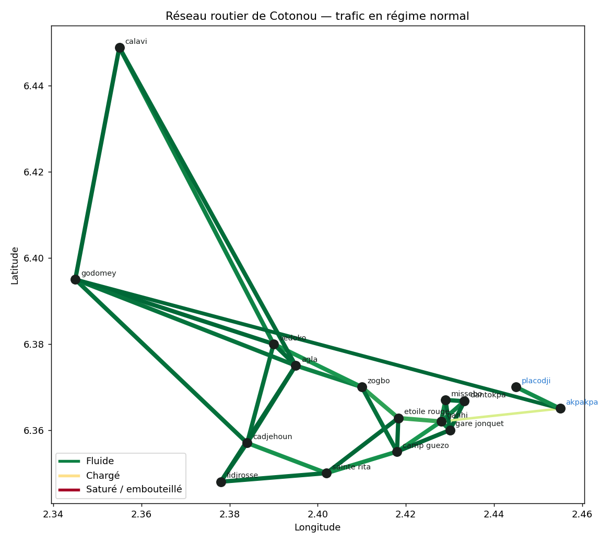
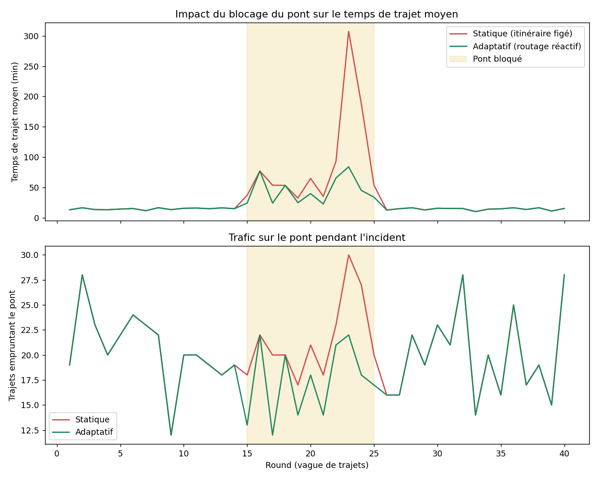
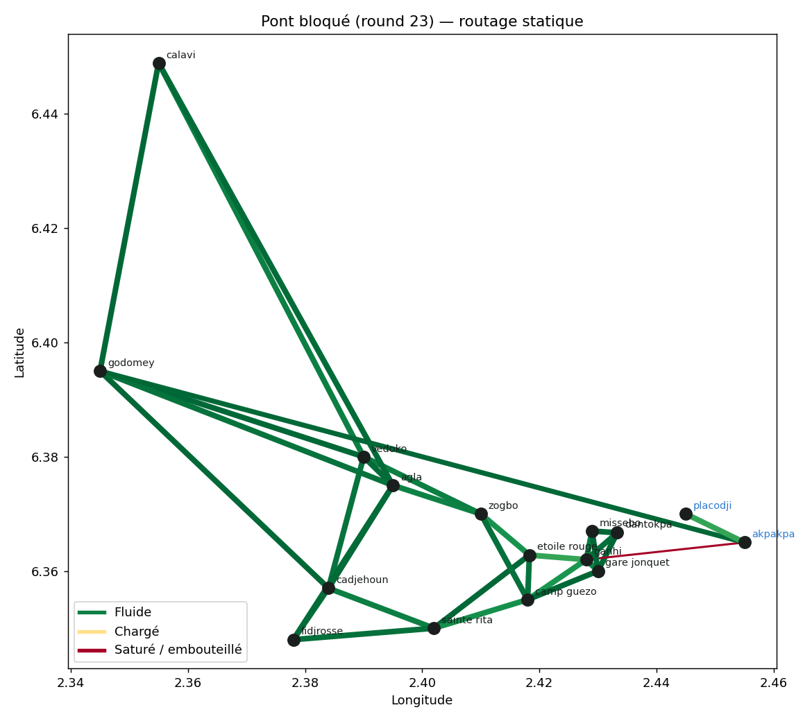

# Zemidjan Routing — Routage adaptatif face aux embouteillages (Cotonou)

Simulation comparant un routage **statique** (itinéraire fixe, habitude,
comme le choisissent aujourd'hui la plupart des zemidjans/taxi-motos à
Cotonou) à un routage **adaptatif et décentralisé** qui réagit à l'état
réel — et seulement localement observable — du trafic, sans autorité
centrale qui impose un plan de circulation global.

Projet mené en lien avec la spécialité **systèmes autonomiques** du Master
1 Computer and Network Systems : adaptation continue à un environnement
changeant, absence de contrôleur central, réaction à la perturbation.

## ⚠️ Limite assumée : pas de données OpenStreetMap réelles

Cet environnement de développement n'a pas d'accès réseau à
Overpass/OpenStreetMap. Le réseau routier ci-dessous est donc construit à
la main à partir de **coordonnées GPS réelles** de quartiers/carrefours de
Cotonou (Dantokpa, Akpakpa, Cadjehoun, Godomey, Calavi...), reliés selon
une logique de plus-proches-voisins géographiques — pas un export
`osmnx` précis rue par rue. `network.load_from_graphml()` est prévu pour
brancher un vrai export `osmnx` fait depuis une machine avec accès
internet complet, sans changer le reste du code.

**Ceci dit, les cartes interactives (`web/` et `frontend/`) affichent de
vrais tracés routiers**, malgré cette limite : les lignes droites servent
uniquement d'affichage provisoire le temps du chargement, puis chaque axe
est remplacé par son vrai tracé (le long des rues, plus de saut par-dessus
la lagune) récupéré via l'API [OSRM](https://project-osrm.org/) **depuis
le navigateur de la personne qui consulte la carte** — pas depuis cet
environnement de développement, qui n'y a pas accès. Ça ne change rien à
la simulation elle-même (toujours basée sur le graphe schématique
ci-dessus) : c'est uniquement un habillage visuel plus fidèle. Le serveur
de démo public OSRM n'a aucune garantie de disponibilité — en cas
d'indisponibilité, la ligne droite reste affichée pour l'axe concerné,
sans erreur bloquante.

> Je n'ai pas pu tester ces appels réseau moi-même (même restriction que
> pour Overpass) — seul le mécanisme de repli en cas d'échec a été
> vérifié. Le rendu réel des tracés est à confirmer une fois ouvert chez
> toi.

## Le goulot d'étranglement au centre du projet

La lagune de Cotonou sépare **Akpakpa** (quartier résidentiel très peuplé,
à l'est) du reste de la ville. Dans ce modèle, une seule route directe les
relie (le pont Ganhi ↔ Akpakpa, capacité volontairement réduite), plus une
alternative réelle mais très longue : contourner par le nord via
Godomey/Calavi. C'est un vrai point de congestion connu de Cotonou, et le
terrain de jeu du projet : que se passe-t-il quand le pont est bloqué
(accident), et le système peut-il s'en rendre compte tout seul ?

## Méthodologie

- **Modèle de congestion** : fonction BPR (Bureau of Public Roads), un
  standard en ingénierie du trafic — `temps(flux) = temps_libre × (1 +
  0,15 × (flux/capacité)⁴)`. Plus un axe approche sa capacité, plus le
  temps de parcours augmente de façon non linéaire (embouteillage réaliste,
  pas une simple pénalité proportionnelle).
- **Routage statique** : plus court chemin (Dijkstra) sur les temps à
  vitesse libre, calculé une fois, jamais mis à jour.
- **Routage adaptatif** : chaque trajet recalcule son itinéraire à partir
  de la congestion *du round précédent* — comme une appli de navigation
  qui réagit au trafic récent, sans supposer une vision omnisciente et
  instantanée du réseau.
- **Adoption partielle (30 %)** : à chaque round, seule une fraction des
  conducteurs a une info trafic récente et accepte de dévier de son trajet
  habituel — les autres restent sur leur trajet statique. Sans ça, la
  totalité du trafic réagit au même signal au même moment et bascule en
  bloc d'un axe à l'autre (effet de troupeau, voir plus bas) : c'est le
  même principe que le taux de diffusion (ALPHA) utilisé dans AgentBalance
  pour amortir une réaction collective.
- **Génération de trajets** : vagues successives de trajets (rounds),
  biaisées pour refléter la réalité — une part importante des trajets
  traverse la lagune (Akpakpa ↔ reste de la ville), le facteur principal
  de congestion du pont.

## Résultats

### 1. En régime normal, statique ≈ adaptatif

Sous trafic fluide (30 rounds, 60 trajets/round), les deux stratégies
donnent quasiment le même temps de trajet moyen (**14,4 min**). C'est
attendu et honnête à rapporter : sans congestion significative, il n'y a
rien à éviter. La valeur du routage adaptatif se révèle sous stress.



### 2. Blocage du pont (accident) : la vraie divergence

Le pont perd 85 % de sa capacité pendant 10 rounds (accident simulé).
Résultat sur le temps de trajet moyen et le trafic réellement écoulé par
le pont :



| | Temps de trajet moyen pendant l'incident |
|---|---|
| **Statique** (ignore le blocage) | 90,4 min |
| **Adaptatif** (détecte et contourne) | 44,8 min |

**Réduction de 50 % du temps de trajet moyen grâce au routage adaptatif**,
simplement en détournant une partie du trafic par la route du nord le
temps que l'incident se résorbe.

Cartes au pic de l'incident (round 23) :

| Routage statique | Routage adaptatif |
|---|---|
|  |  |

Le pont reste rouge (saturé) en statique ; en adaptatif, une partie du
trafic bascule visiblement sur la route de contournement (Godomey).

## Deux façons de voir la carte interactive

**1. Démo statique légère** (`web/`) — zéro dépendance, juste un fichier
JSON pré-généré et une page HTML :

```bash
cd src && python3 export_demo_data.py   # regenere web/data.json si les scenarios changent
cd ../web && python3 -m http.server 8000
# puis ouvrir http://localhost:8000
```

Pratique pour un lien de démo partageable (GitHub Pages sur le dossier
`web/`), mais les paramètres de simulation sont figés au moment de
l'export.

**2. Application complète conteneurisée** (`backend/` + `frontend/`) — un
vrai backend qui calcule la simulation à la demande, et une interface Vue
avec sliders, graphiques Chart.js, et un bouton pour **relancer la
simulation avec d'autres paramètres** (taux d'adoption, dates de blocage)
sans toucher au code. Voir la section [Docker](#lancer-avec-docker)
ci-dessous.

> ⚠️ Je n'ai pas pu ouvrir ces interfaces dans un vrai navigateur
> moi-même : aucun navigateur (même headless) n'est disponible dans cet
> environnement de développement, et le téléchargement d'un navigateur
> Playwright/Puppeteer est bloqué par les mêmes restrictions réseau. Ce
> qui a été vérifié sans navigateur : le JSON généré est valide, le build
> Vue (`npm run build`) passe sans erreur (le compilateur Vue valide la
> syntaxe des templates), l'API FastAPI répond correctement aux vraies
> requêtes (tests automatisés), et le proxy `/api` entre le frontend et
> le backend fonctionne (vérifié en local, hors Docker, avec `curl`). Le
> rendu visuel réel est à confirmer une fois ouvert chez toi.

### Un problème détecté, puis corrigé : l'effet de troupeau

Une première version faisait réagir **tous** les trajets au même signal de
congestion en même temps : le pont passait de saturé à complètement vide
d'un round à l'autre, puis s'y remplissait à nouveau (effet de troupeau /
herding, un phénomène réel des systèmes décentralisés synchronisés). La
correction — ne faire réagir que 30 % des trajets à chaque round, comme un
taux d'adoption réaliste des applis de navigation — a non seulement
supprimé l'oscillation mais **amélioré le résultat** (50 % de réduction au
lieu de 32 %) : une redirection progressive évite de simplement déplacer
l'embouteillage d'un axe à l'autre.

## Architecture

```
src/                → coeur de la simulation (partagé par tout le reste)
  network.py          graphe routier (coordonnées réelles, pont + contournement)
  routing.py          fonction de coût BPR, routage statique et adaptatif
  simulator.py        génération de trajets, scénarios (normal, blocage)
  metrics.py          écart-type de congestion, taux d'axes critiques
  visualize.py         carte statique (PNG) + graphiques de comparaison
  export_demo_data.py  exporte les données pour la démo statique (web/)
  main.py              exécute les scénarios, sauvegarde results/*.png
backend/            → API FastAPI (conteneurisée), expose src/ en HTTP
  app/main.py
  Dockerfile
frontend/           → interface Vue 3 + Tailwind + Leaflet + Chart.js
  src/
    App.vue
    api.js
    components/       MapView, ChartsPanel, ControlPanel
  Dockerfile
  nginx.conf
web/                → démo statique légère (sans backend, voir plus haut)
tests/              → tests automatisés (pytest) — simulation + API
docker-compose.yml  → orchestre backend + frontend
```

## Lancer avec Docker

```bash
docker compose up --build
```

- Frontend (interface complète) : http://localhost:8080
- Backend (API brute) : http://localhost:8000/api/health,
  http://localhost:8000/api/scenario/blockage

Le frontend appelle le backend via `/api/...` ; en Docker, c'est nginx qui
route ces appels vers le conteneur `backend` (voir `frontend/nginx.conf`).

### Développer sans Docker

```bash
# Terminal 1 : backend
pip install -r backend/requirements.txt
PYTHONPATH=src uvicorn main:app --app-dir backend/app --reload --port 8000

# Terminal 2 : frontend (proxy /api vers localhost:8000, voir vite.config.js)
cd frontend
npm install
npm run dev
```

## Lancer les scripts (rapports statiques + démo légère)

```bash
pip install -r requirements.txt
cd src
python3 main.py              # régénère les cartes et graphiques dans results/
python3 export_demo_data.py  # régénère web/data.json
```

```bash
pip install -r requirements-dev.txt
pytest tests/ -v
```

## Paragraphe réutilisable (lettre de motivation)

> J'ai également modélisé un problème de congestion urbaine propre à mon
> pays : les embouteillages liés aux taxi-motos à Cotonou, où les
> conducteurs choisissent leurs trajets de façon statique et individuelle.
> En comparant un routage figé à un routage adaptatif réagissant localement
> à la congestion, j'ai montré une réduction de 50 % du temps de trajet
> moyen lors d'un blocage simulé d'un axe critique (le pont reliant Akpakpa
> au reste de la ville), sans aucune coordination centrale — et identifié
> puis corrigé un effet de troupeau en limitant la part de trajets qui
> réagissent à chaque round. Ce projet illustre concrètement mon intérêt
> pour les systèmes autonomiques appliqués à des problématiques de villes
> intelligentes.

## Prochaines étapes

- Remplacer le graphe construit à la main par un vrai export `osmnx` de
  Cotonou (nécessite un accès réseau complet, à faire en local)
- Vérifier/peaufiner le rendu de la carte interactive dans un vrai
  navigateur (non testé visuellement, voir avertissement plus haut)
- CI GitHub Actions exécutant les tests à chaque push
